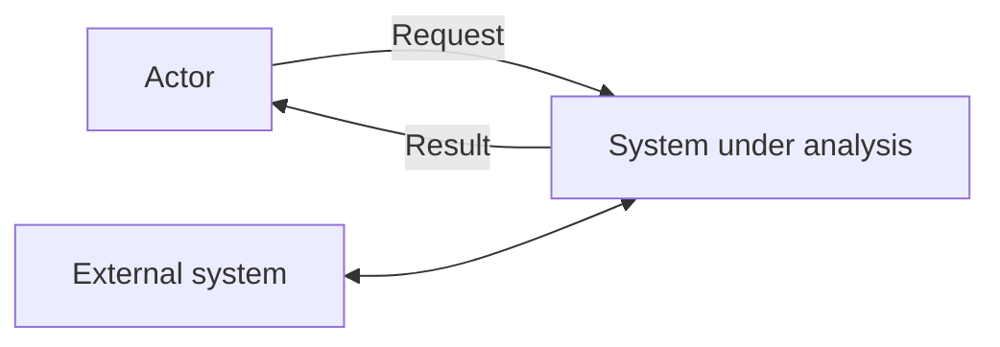
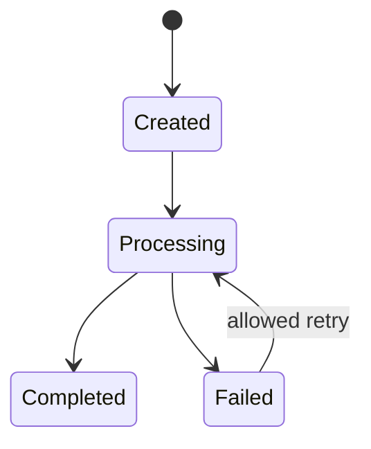
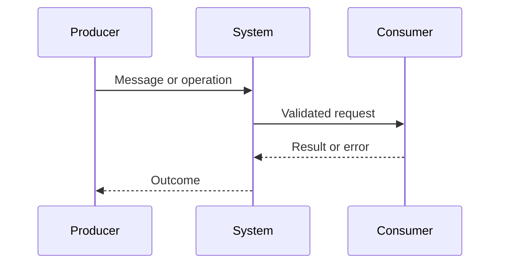

# Models - {{RUN_TITLE}}

## SYS context: purpose, boundary, actors, components, external systems и trust boundaries

## DATA: owner, entities, identifiers, constraints, lifecycle, retention и classification

## SYS states, transitions, invariants и recovery

## SYS/INT sequence, alternate/error flows и trust crossings

## INT owners, producer/consumer, direction, protocol и operations/messages

## INT schemas, versioning, auth mechanism, privacy и data classification

## INT errors, timeout, retry, idempotency, ordering, deduplication и compensation

## INT compatibility, deprecation, SLA/SLO, observability и verification

Mermaid является portable default. Диаграмма должна иметь refs на proposed SYS/INT и не заменяет текстовую семантику.

## Assumptions и refs
