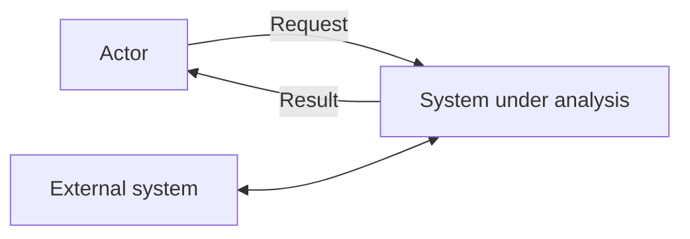
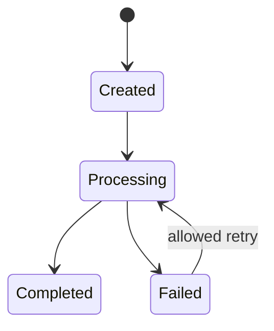
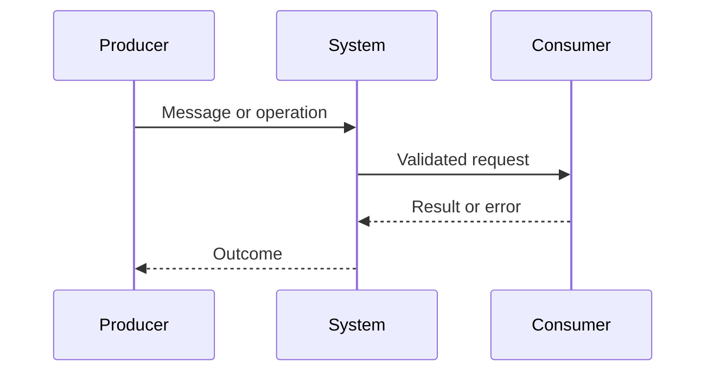

# Models - {{RUN_TITLE}}

## Requirements architecture

Покажи decomposition, grouping, interfaces и dependencies между STK/CAP/BP/RULE/BR и UC/FR/NFR/DATA/INT/SYS/AC/SPEC. Отметь conflicts, missing edges, ownership и change-sensitive boundaries.

## Representation choice и semantic subset

- Narrative - для простой цели, взаимодействия или правила, когда графическая нотация не добавляет проверяемости.
- BPMN-aligned subset - participants/pools, start/end/intermediate events, tasks, sequence/message flows, gateways, exceptions и compensation/recovery.
- DMN-aligned subset - inputs, decisions, knowledge/rule dependencies, decision table conditions/actions, hit policy и default/error outcome.

Проверь согласованность narrative, process и decision semantics. Не заявляй formal BPMN/DMN conformance и не придумывай отсутствующие business rules.

## Architecture decision context, drivers и constraints

Audience, stakeholder concerns/viewpoints, functional drivers, quality scenarios, data/integration/security/operational constraints, assumptions и evidence refs. Не превращай предпочтение в constraint.

## SYS context: purpose, boundary, actors, components, external systems и trust boundaries

## DATA: owner, entities, identifiers, constraints, lifecycle, retention и classification

## DATA storage и movement rationale

Для каждого варианта объясни ownership, authoritative source, consistency/transaction needs, access pattern, lifecycle, retention, classification, transfer и почему выбранный тип хранения технически подходит. Конкретный product/stack не изобретай.

## SYS states, transitions, invariants и recovery

## SYS/INT sequence, alternate/error flows и trust crossings

## INT owners, producer/consumer, direction, protocol и operations/messages

## INT schemas, versioning, auth mechanism, privacy и data classification

## INT errors, timeout, retry, idempotency, ordering, deduplication и compensation

## INT compatibility, deprecation, SLA/SLO, observability и verification

Mermaid является portable default. Диаграмма должна иметь refs на proposed SYS/INT и не заменяет текстовую семантику.

## Quality scenarios

| Scenario ID | Source | Stimulus | Environment | Affected artifact | Response | Response measure | Priority | Verification method |
|---|---|---|---|---|---|---|---|---|
| | | | | | | | | |

Неметричный scenario остается gap. Threshold, unit или operating condition не выводятся из практики без evidence/authority.

## Architecture options matrix

Для `architecture` сравни минимум два технически реалистичных варианта по одним evidence-backed criteria.

| Option | Drivers/constraints fit | Benefits | Trade-offs | Risks | Assumptions to validate | Evidence/limitations |
|---|---|---|---|---|---|---|
| A | | | | | | |
| B | | | | | | |

## Component catalog

| Component/ref | Responsibility | Inputs | Outputs | Dependencies | Data owner | Failure/recovery responsibility |
|---|---|---|---|---|---|---|
| | | | | | | |

Используй C4-aligned Context/Container viewpoints и exact SYS/INT/DATA refs, но не заявляй formal C4 conformance.

## Trust boundaries, threats и security controls

Assets/data classes, actors, boundary crossings, plausible threats/abuse, control objective, proposed control, residual risk и verification ref. Не подменяй security evidence названием технологии.

## Deployment, operations и recovery view

Execution/deployment units, environments/zones, dependencies, configuration/secrets boundary, observability, scaling/failure domains, rollout/rollback assumptions, backup/restore, RTO/RPO source, recovery flow и operator responsibility. Не изобретай topology или thresholds.

## Proposed solution strategy и ADR candidate

Объясни, какой вариант условно лучше отвечает drivers, при каких assumptions/evidence, какие risks/dependencies остаются и что должен решить authority owner. Это recommendation proposal: скрытый выбор, architecture acceptance и accepted ADR запрещены. Implementation plan находится только в отдельном Plan v2.

## Assumptions, unresolved questions и refs
