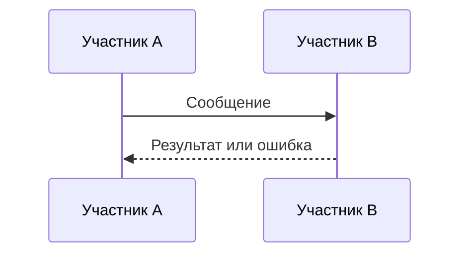
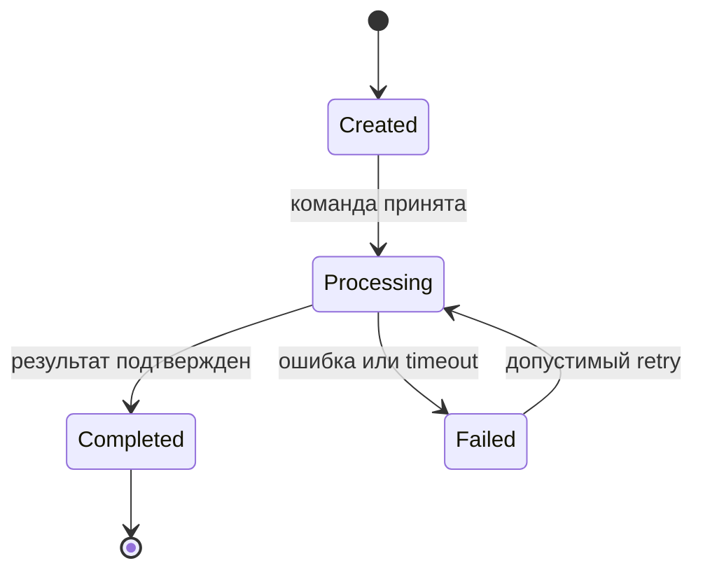

# SYS-0001 - Название

Выбери ровно один kind: DATA, INT или SYS, затем синхронно измени `artifact_kind`, ID, filename и применимые разделы.

## Common: purpose, decision context, source и requirement refs

## DATA: owner, consumers, entities, fields, identifiers и constraints

## DATA: classification, lineage, lifecycle, retention, integrity и quality rules

## DATA: storage rationale, access, migration, backup и recovery

Storage rationale описывает drivers и trade-offs, но не изобретает stack или скрытый architecture choice.

## INT: scope, producer, consumer, protocol и direction

## INT: operations/messages, versioning, schema и optional OpenAPI/AsyncAPI attachment

## INT: auth mechanism, trust boundary, privacy и data classification

## INT: errors, timeout, retry, idempotency, ordering, deduplication и compensation

## INT: compatibility, deprecation, SLA/SLO, observability и verification

## SYS: audience, boundary, actors, external systems и stakeholder concerns

## SYS: architecture drivers, quality scenarios и constraints

Каждый quality scenario ссылается на `NFR-*`. Driver или constraint требует source; отсутствие evidence остается assumption или unresolved question.

## SYS: requirements architecture

Покажи связи STK/CAP/BP/RULE/BR с UC/FR/NFR, DATA, INT, SYS, AC и SPEC без создания второго normative owner.

## SYS: component catalog

Для каждого component укажи responsibility, inputs, outputs, dependencies, owned data и внешние effects.

## SYS: data and integration view

Укажи DATA/INT refs, storage rationale, contracts, consistency boundaries и failure semantics.

## SYS: security and privacy view

Укажи assets, trust boundaries, threats, controls, identities, authorization, data classification и residual risks. Не объявляй безопасность доказанной без evidence.

## SYS: states, transitions, invariants и recovery

## SYS: sequences, alternate/error flows, timeout/retry/compensation и trust boundaries

## SYS: deployment, operations, observability и recovery view

Описывай только подтвержденные execution units, environments, dependencies, health signals, backup/recovery assumptions и operational owners. Не изобретай topology, SLO или runbook.

## SYS architecture intent: options, criteria, trade-offs и risks

Для `intent_id: architecture` представь минимум два технически реалистичных варианта, evidence-backed criteria, trade-offs, risks и unresolved questions. Context, component/container-like и deployment views являются C4-aligned semantic views без заявления formal conformance.

## SYS architecture intent: proposed strategy и ADR candidate

Strategy и ADR candidate остаются предложением. Этот artifact не выбирает вариант, не подтверждает архитектуру и не принимает ADR.

Диаграммы только визуализируют семантику участников, responsibilities, сообщений, ошибок, состояний, переходов и deployment relations. Нормативное описание остается в соответствующем `SYS-*`, `DATA-*` или `INT-*`.

## Assumptions, risks, residual risk и unresolved questions

## Acceptance, factual verification, review и approval separation

`decision_refs` связывает model с `REV-*`; `verification_refs` хранит фактические checks. Architecture review или accepted ADR не заменяет `approval_ref`.
