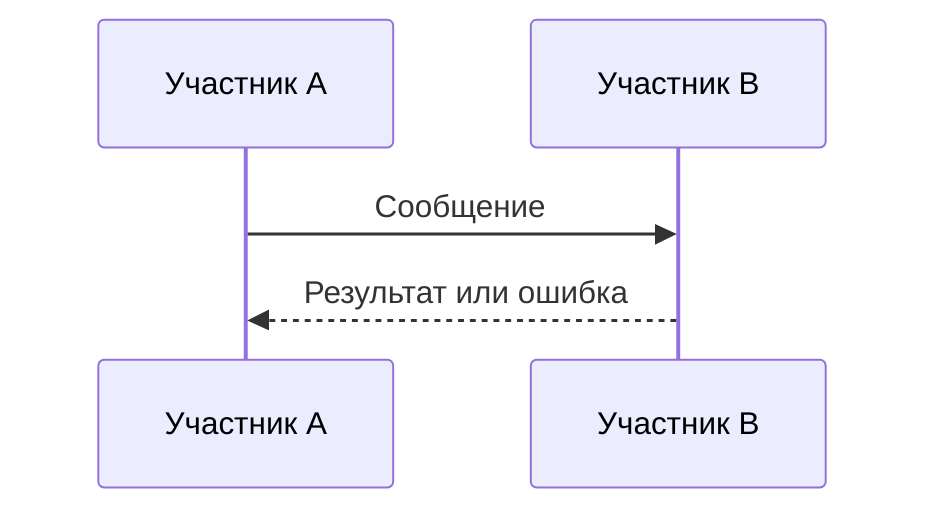
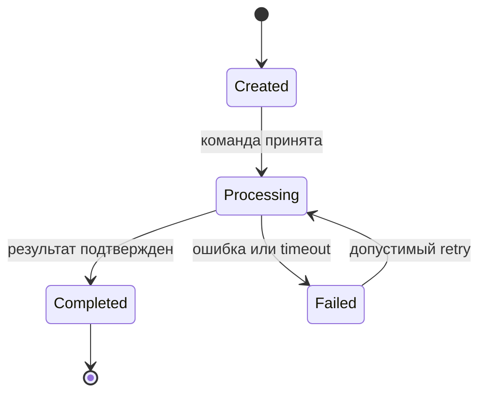

# SYS-0001 - Название

Выбери ровно один kind: DATA, INT или SYS, затем синхронно измени `artifact_kind`, ID, filename и применимые разделы.

## DATA: owner, entities, fields, identifiers, constraints, lifecycle, retention и classification

## INT: scope, producer, consumer, protocol и direction

## INT: operations/messages, versioning, schema и optional OpenAPI/AsyncAPI attachment

## INT: auth mechanism, trust boundary, privacy и data classification

## INT: errors, timeout, retry, idempotency, ordering, deduplication и compensation

## INT: compatibility, deprecation, SLA/SLO, observability и verification

## SYS: boundary, actors, components, responsibilities и external systems

## SYS: states, transitions, invariants и recovery

## SYS: sequences, alternate/error flows, timeout/retry/compensation и trust boundaries

Диаграммы только визуализируют семантику сообщений, ошибок, состояний и переходов. Нормативное описание остается в соответствующем `SYS-*` или `INT-*`.

## Assumptions, risks, relations и verification
